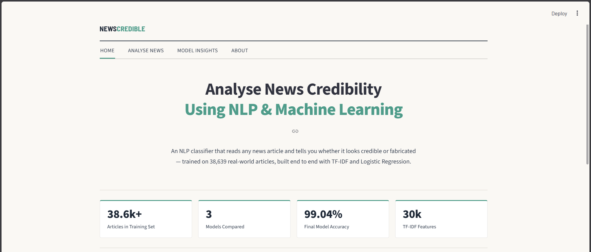
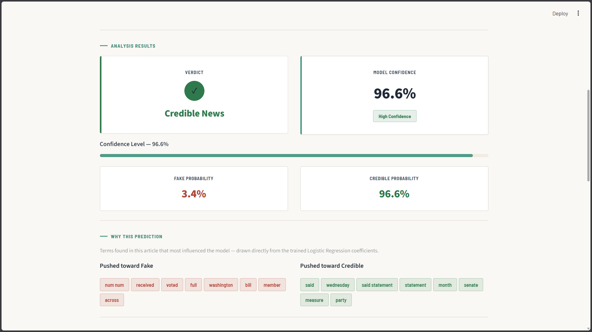
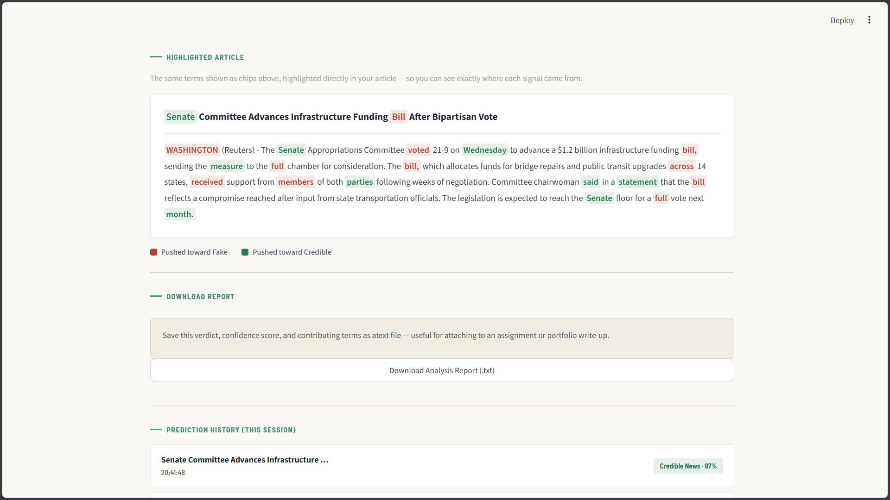
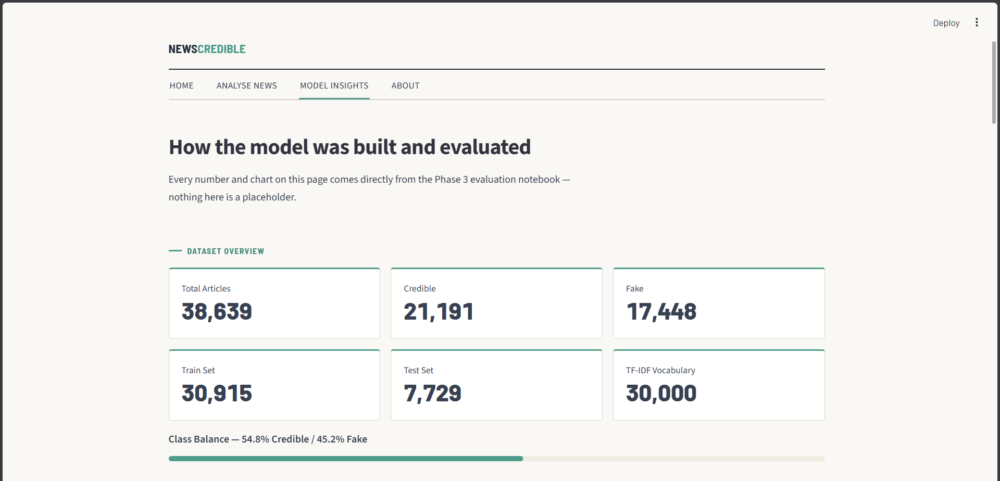
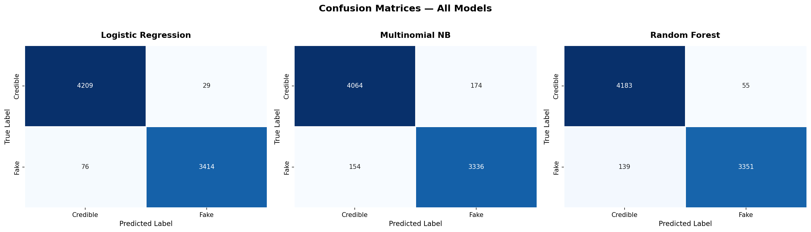
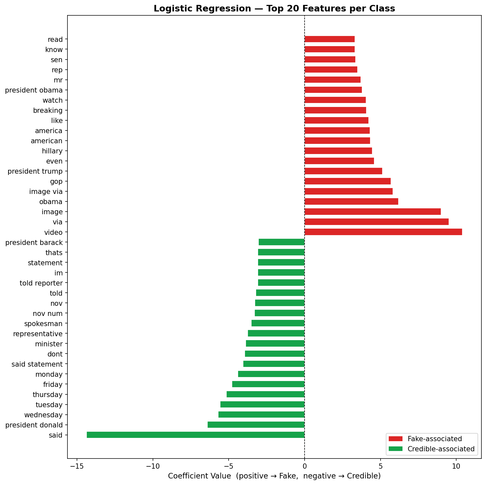
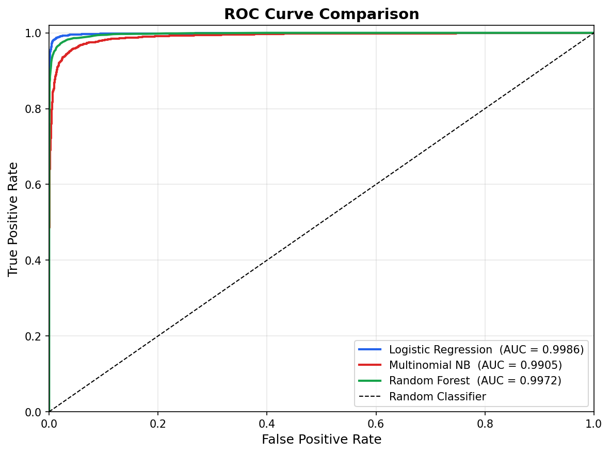

# News Credibility Analyser

> An NLP + Machine Learning web app that classifies news articles as **Credible** or **Fake**, with full model explainability — built with TF-IDF, Logistic Regression, and Streamlit.


---

## Key Highlights

- 38,639 real-world news articles (ISOT dataset)
- 30,000-feature TF-IDF vector space (unigrams + bigrams)
- 3 ML models trained and compared (Logistic Regression, Multinomial Naive Bayes, Random Forest)
- Fully explainable predictions — every verdict traces back to real model coefficients, no black box
- A dataset-leakage issue identified, investigated, and corrected during development — fully documented in the limitations section

---

## What This App Actually Does

You paste a news article's title and body. The app:

1. Cleans the text using the exact same preprocessing pipeline used at training time (lowercasing, source-leak stripping, URL/HTML removal, stopword removal, lemmatisation).
2. Converts it into a 30,000-feature TF-IDF vector.
3. Runs it through a trained Logistic Regression model.
4. Returns a **Credible / Fake verdict**, a **confidence score**, a **confidence tier**, and the **actual words from your article** that pushed the prediction each way — pulled directly from the model's learned coefficients.

It does **not** fetch or verify facts, check sources, browse the web, or know anything about events after its training data. It judges how closely an article's _writing style and vocabulary_ resembles the Credible or Fake examples it was trained on — nothing more. See [Known Limitations](#known-limitations) for what that means in practice.

---

## Screenshots

### Home Page



### Analyse News


### Prediction Results



### Explainability View



### Model Insights



---

## Project Overview

This project demonstrates an end-to-end NLP and Machine Learning workflow, covering:

- Data preprocessing
- Feature engineering with TF-IDF
- Model training and comparison
- Explainable predictions
- Streamlit-based deployment

The goal is to classify news articles as Credible or Fake while maintaining transparency into how the model reaches its decisions.

---

## Project Architecture

```text
                               USER
                                 │
                                 ▼
                     ┌─────────────────────┐
                     │    Streamlit UI     │
                     │      app.py         │
                     └──────────┬──────────┘
                                │
                                ▼
                ┌──────────────────────────────┐
                │      UI Components           │
                │  components.py + styles.py   │
                └──────────┬───────────────────┘
                           │
                           ▼
                ┌──────────────────────────────┐
                │      Prediction Engine       │
                │         utils.py             │
                └──────────┬───────────────────┘
                           │
                           ▼
                ┌──────────────────────────────┐
                │     Text Preprocessing       │
                │                              │
                │ • Lowercasing                │
                │ • Reuters Leak Removal       │
                │ • URL Removal                │
                │ • HTML Stripping             │
                │ • Number Normalisation       │
                │ • Stopword Removal           │
                │ • Lemmatisation              │
                └──────────┬───────────────────┘
                           │
                           ▼
                ┌──────────────────────────────┐
                │      TF-IDF Vectorizer       │
                │      vectorizer.pkl          │
                │      30,000 Features         │
                └──────────┬───────────────────┘
                           │
                           ▼
                ┌──────────────────────────────┐
                │ Logistic Regression Model    │
                │         model.pkl            │
                └──────────┬───────────────────┘
                           │
                           ▼
                ┌──────────────────────────────┐
                │ Prediction + Confidence      │
                │ Explainability Analysis      │
                └──────────┬───────────────────┘
                           │
                           ▼
                ┌──────────────────────────────┐
                │ Results Displayed to User    │
                │                              │
                │ • Credible / Fake Verdict    │
                │ • Confidence Score           │
                │ • Confidence Tier            │
                │ • Highlighted Terms          │
                │ • Downloadable Report        │
                └──────────────────────────────┘
```

---

## Features

| Feature                      | Description                                                                                          |
| ---------------------------- | ---------------------------------------------------------------------------------------------------- |
| Instant prediction           | Title + body in, verdict + confidence out                                                            |
| Confidence tiers             | High (≥85%) / Moderate (60–85%) / Uncertain (<60%), with a warning banner on Uncertain results       |
| Explainability               | Top contributing terms shown as chips, pulled from real Logistic Regression coefficients             |
| Highlighted article view     | Contributing terms highlighted in place, inside your actual pasted article                           |
| Downloadable analysis report | Verdict, confidence, and top terms exported as a `.txt` file                                         |
| Prediction history           | Session-based, last 10 predictions                                                                   |
| Sample articles              | One-click fake-style and credible-style examples for demoing                                         |
| Model Insights page          | Accuracy/precision/recall/F1/ROC-AUC across all three models, confusion matrices, feature importance |
| About page                   | Full pipeline walkthrough, dataset sources, and the notebooks behind the deployed model              |

---

## Tech Stack

Python · Streamlit · scikit-learn · NLTK · pandas · NumPy · TF-IDF · Logistic Regression · Joblib

---

## How the Model Was Built

| Step | Notebook                     | What happens                                                                                                                                                                                 |
| ---- | ---------------------------- | -------------------------------------------------------------------------------------------------------------------------------------------------------------------------------------------- |
| 1    | `01_eda_preprocessing.ipynb` | Load & merge `Fake.csv` + `True.csv` (ISOT dataset), dedupe, drop `subject`/`date`, shuffle, save `cleaned.csv`                                                                              |
| 2    | `02_feature_model.ipynb`     | Text cleaning → TF-IDF vectorisation (unigrams + bigrams, 30,000 features) → train/compare Logistic Regression, Multinomial Naive Bayes, Random Forest → save `model.pkl` + `vectorizer.pkl` |
| 3    | `03_evaluation.ipynb`        | Load the saved model/vectorizer → confusion matrices, ROC curves, feature importance, final metrics table                                                                                    |

**Model selection rule:** pick the simplest model within 1% F1 of the best performer. Random Forest scored marginally higher, but Logistic Regression was chosen for interpretability (coefficients directly explain every prediction) and ~30x faster training.

## Final Results

| Metric              | Value                       |
| ------------------- | --------------------------- |
| Dataset Size        | 38,639 Articles             |
| TF-IDF Features     | 30,000 (Unigrams + Bigrams) |
| Models Compared     | 3                           |
| Final Model         | Logistic Regression         |
| Accuracy            | 98.64%                      |
| Precision           | 98.69%                      |
| Recall              | 98.57%                      |
| F1 Score            | 98.63%                      |
| ROC-AUC             | 99.86%                      |
| Cross-Validation F1 | 98.53% ± 0.10%              |

---

### Model Selection

Three machine learning models were trained and evaluated:

- Logistic Regression
- Multinomial Naive Bayes
- Random Forest

Logistic Regression was selected as the final deployment model due to its strong performance, high interpretability, and efficient inference time. Its coefficients also enable explainable predictions by showing which terms contribute most strongly toward a Credible or Fake classification.

---

## Model Evaluation Visualizations

### Confusion Matrices

Shows the classification performance of all three trained models on the held-out test set.



---

### Feature Importance Analysis

Top positive and negative Logistic Regression coefficients showing which terms most strongly influenced predictions.



---

### ROC Curve Comparison

Receiver Operating Characteristic (ROC) curves comparing all models across different classification thresholds.



---

## Known Limitations

This model has a documented dataset-leakage issue, found and partially fixed during development — flagged here deliberately rather than left for someone else to discover.

**Problem →** ISOT's "Credible" class is almost entirely Reuters wire copy; "Fake" comes from differently-formatted sources. TF-IDF + Logistic Regression, having no concept of meaning, learned to detect _source formatting_ instead of _content_.

**Cause →** Two concrete leaks were found by testing the model against a real, legitimately-reported non-Reuters article that was confidently misclassified as Fake, then confirmed by inspecting the model's top coefficients:

1. The literal word **"reuters"** — nearly every credible article's dateline (`WASHINGTON (Reuters) -`) made this a near-perfect label proxy.
2. **Photo-caption artifacts ("via", "image")** — Fake.csv articles were scraped with embedded photo credits (e.g. `Image via Getty`) that Reuters text never has; at one point these were the two largest coefficients in the entire model.

**Fix →** Both patterns are stripped in `clean_text()`, applied identically in `02_feature_model.ipynb` (training) and `app/utils.py` (inference) — these two must always stay in sync.

**Impact →** There's likely a structural ceiling here: because the Credible class is essentially Reuters-only, some residual house-style signal (`said`, `minister`, `government`) will always leak through TF-IDF regardless of blocklisting — a genuinely complete fix needs a dataset with credible articles from multiple outlets, which is outside this project's scope. Practically, this means the model generalises worse to non-Reuters credible sources than test accuracy suggests, and is trained/evaluated only on English-language political news.

**If testing this model:** don't judge it on one article — test a mix of Reuters and non-Reuters credible sources, obvious fakes, and non-political topics before drawing conclusions.

---

## Confidence Tiers

| Probability | Tier                | Meaning                            |
| ----------- | ------------------- | ---------------------------------- |
| ≥ 85%       | High Confidence     | Result is reliable                 |
| 60–85%      | Moderate Confidence | Likely correct, treat with caution |
| < 60%       | Uncertain           | Verify manually                    |

---

## Project Structure

```text
News_Credibility/
│
├── app/                          # Streamlit application
│   ├── app.py                    # Main application
│   ├── components.py             # Reusable UI components
│   ├── config.py                 # Constants and metrics
│   ├── styles.py                 # Custom styling
│   └── utils.py                  # Preprocessing and prediction pipeline
│
├── assets/                       # Evaluation visualisations
│   ├── confusion_matrices.png
│   ├── feature_importance.png
│   └── roc_curves.png
│
├── data/
│   ├── Fake.csv                  # Original fake-news dataset
│   ├── True.csv                  # Original credible-news dataset
│   └── processed/
│       ├── cleaned.csv           # Merged and cleaned dataset
│       ├── train.csv             # Training split
│       └── test.csv              # Test split
│
├── models/
│   ├── model.pkl                 # Trained Logistic Regression model
│   └── vectorizer.pkl            # Fitted TF-IDF vectorizer
│
├── notebooks/
│   ├── 01_eda_preprocessing.ipynb
│   ├── 02_feature_model.ipynb
│   └── 03_evaluation.ipynb
│
├── requirements.txt
└── README.md
```

---

## Setup & Installation

```bash
# 1. Clone the repository
git clone https://github.com/dodiyariya6/News-Credibility-Analyser.git

# 2. Navigate to the project directory
cd News-Credibility-Analyser

# 3. Create a virtual environment
python -m venv venv

# 4. Activate the virtual environment

# Windows
venv\Scripts\activate

# Linux / macOS
source venv/bin/activate

# 5. Install dependencies
pip install -r requirements.txt

# 6. Launch the application
streamlit run app/app.py
```

### Requirements

- Python 3.11+
- Internet connection on first run (required for NLTK resource download)

The application automatically downloads the required NLTK resources:

- punkt
- stopwords
- wordnet

---

## Retraining the Model

1. Run `01_eda_preprocessing.ipynb` top to bottom (only if `data/Fake.csv`/`data/True.csv` changed).
2. Run `02_feature_model.ipynb` top to bottom — re-fits TF-IDF and retrains all three models, saving new `model.pkl`/`vectorizer.pkl` into `models/`.
3. Run `03_evaluation.ipynb` top to bottom (**after** step 2) — regenerates confusion matrices, ROC curves, feature importance, and metrics.
4. Copy the new `.pkl` files into `models/` and new `.png` charts into `assets/`.
5. Update the metrics in this README and in `config.py`'s `MODEL_METRICS` / `DATASET_STATS`.

**Important:** `clean_text()` exists in two places — `02_feature_model.ipynb` and `app/utils.py`. Keep them identical, or the app's predictions will be based on a different feature space than the model was trained on.

---

## Dataset Credit

[ISOT Fake News Dataset](https://onlineacademiccommunity.uvic.ca/isot/) — University of Victoria. 38,639 real and fake articles sourced from Reuters and PolitiFact/other flagged sources.

---

## Author

**Riya Dodiya**

B.Tech Artificial Intelligence & Machine Learning

Developed as part of an academic project focused on Natural Language Processing, Machine Learning, and Explainable AI.

---

## License & Disclaimer

Developed for academic submission as an educational NLP/ML portfolio project. It is not a substitute for professional fact-checking — always verify news through trusted, independent sources.
